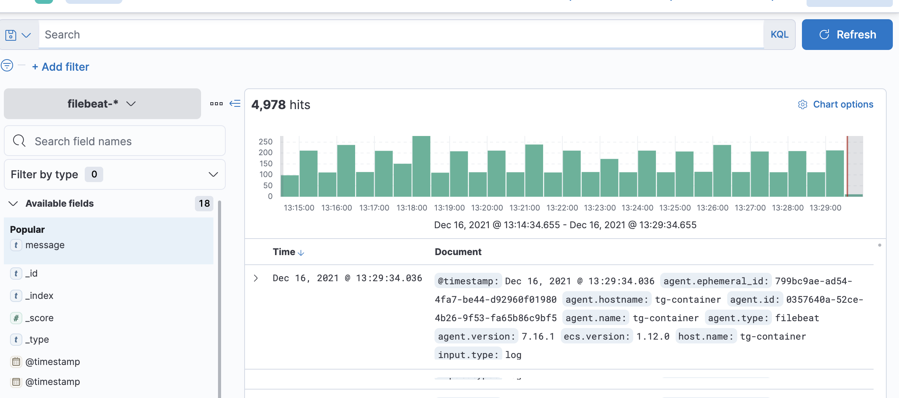
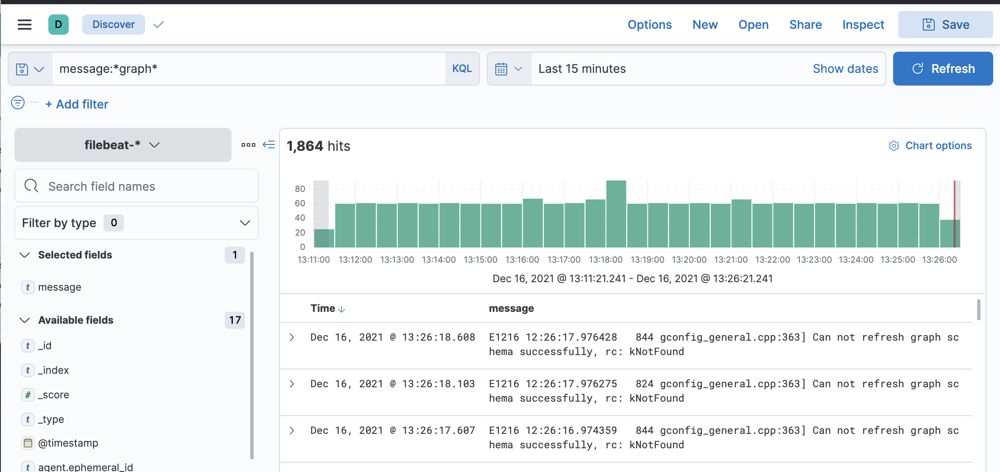

#  TigerGraph with ElasticSearch / Kibana / Filebeat Integration in Docker Compose

## Overview 

Sample way to configure ElasticSerch / Kibana logs using docker-compose.

Based on this [blog](https://medium.com/@huangkai.hsu-/centralized-tigergraph-logs-with-elasticsearch-kibana-and-filebeat-dadf308d3aea)

## Setup (once off)

1. Clone this repo 

2. Do a docker-compose up (including the build parameter)
```
docker-compose up -d --build
```

3. Wait for the kibana UI to be ready at (http://localhost:5601/)

4. Execute the following command
```
docker exec -ti -u root tg-container 'filebeat setup -e'
```

## Startup

Once the solution has been setup, all you need to do is a docker-compose up whenever you want to use the solution 

```
docker-compose up -d
```


## Usage

### TigerGraph

TigerGraph is available on the following location

http://localhost:14240/


### Kibana

If everything has been setup correctly, then you should be able to see the tigergraph logs in the discover section of kibana. 

http://localhost:5601/app/discover





The "filebeat" index should already be configured. So if you add the "message" field to the "Selected Fields" and execute the following search

```
message:*graph*
```

you should see some more interesting results




Once you have the data available, you can start to construct some dashboards.


## Solution Details 

Contains a custom [Dockerfile](src/main/docker/tigergraph/Dockerfile) that includes (and configures) the filebeat service in the image. 

The sample [filebeat.yml](src/main/docker/tigergraph/filebeat.yml) was customized form the command
```
gadmin log build filebeat --host=es-container
```

The solution contains the following three containers

* tg-container (TigerGraph container)
* es-container (ElasticSearch container)
* kb-container (Kibana container)
